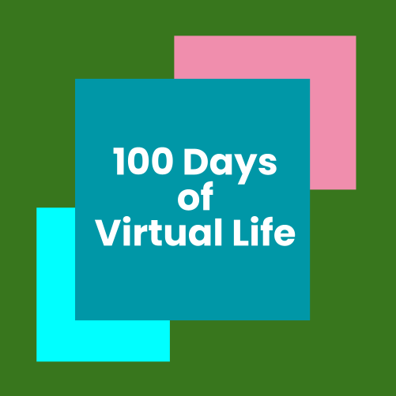

# 100 Days of Simulated Consciousness
### Daily Experiments in Emergent Behavior, Collective Ecosystems, Virtual Life, Digital Agency, and Distributed Cognition

## Day: 40
### Software Tally

- Unity : 31.5
- p5 : 5
- Blender: 1.5
- three.js : 1
- MS paint: 1
- Unreal : 0
- Touch Designer : 0

A huge chunk of days exist on my [ML-Agents Repo](https://github.com/augustluhrs/ml-agents)
 

### Idea Board
- [Nature of Code](https://natureofcode.com/book/)
    - ~~Random Walk~~ Day 1
    - Vectors
    - Forces
        - ~~Skull Attraction~~ Day 6
    - Oscillation
    - Particle Systems
    - Physics Libraries
        - ~~Problem Avoidance~~ Day 7
    - Autonomous Agents
        - Flocking
            - ~~three gltf basics~~ Day 4
    - Cellular Automata
        - ~~Social Flowers Game of Life~~ Day 3
            - seed/death/bloom
            - interactive selection
            - slider vibe
    - Fractals
    - Evolution of Code
        - ~~Smart Rockets~~ Day 8
        - ~~Smart Rockets in Unity~~ Day 9
        - Interactive Selection
    - Neural Networks
        - ~~old DIY NN~~ Day 27
        - new DIY NN
- [Twitch Plays God](https://github.com/augustluhrs/Twitch_Plays_God)
    - ~~Cyclical Closed Loop Rock Paper Scissors type thing~~ Day 2
- [ML-Agents](https://github.com/Unity-Technologies/ml-agents)
    - ~~Hello World Soccer with Animals~~ Day 18
    - ~~Learn to Walk~~ Day 33
    - ~~Bunch of stuff~~ Day 34-39
        - Single-Agent Training
        - Simultaneous Single-Agent Training
        - Adversarial Self-Play
        - Cooperative Multi-Agent
        - Competitive Multi-Agent
        - Ecosystem
    - bridge builders
    - art builders
    - keep away
- [Sebastian Lague](https://www.youtube.com/c/SebastianLague)
    - [Boids Sphere Rays and Compute Shader](https://www.youtube.com/watch?v=bqtqltqcQhw&list=PLQgC61XzV8DOdEDEXVn6CL11tx3trnyCl&index=3)
    - [Simulated Ecosystem](https://www.youtube.com/watch?v=r_It_X7v-1E&list=PLQgC61XzV8DOdEDEXVn6CL11tx3trnyCl)
    - [Compute Shaders](https://www.youtube.com/watch?v=9RHGLZLUuwc&list=WL&index=41)
    - [Marching Cubes](https://www.youtube.com/watch?v=M3iI2l0ltbE&list=WL&index=40)
    - [Slime Simulation](https://www.youtube.com/watch?v=X-iSQQgOd1A&list=WL&index=37)
        - ~~Slime Mold~~ Day 11
    - [Elegant Emergence](https://www.youtube.com/watch?v=kzwT3wQWAHE&list=WL&index=38)
- Bodies
    - a sound machine like a throat
    - car battery suspended in a jellied cantaloupe
    - procedurally generated critters
    - ~~electrical signals powering muscles~~ Day 12
    - IK animations
    - growing muscle tissue / protein cell network contraction
- Multiplayer
    - Mass Interactive Selection
- Optimization / Algorithms
    - Shaders
    - Quad Tree vs Normal Comparison
    - Coroutines / Tasks
- Magic Leap
    - critters on the meshes
- Possible Themes
    - death
    - capitalism
    - zen
    - absurdity
    - climate change (hmm)
    - intergenerational trauma
    - social media
        - attention as commodity
        - vulnerability addiction / trauma porn
    - ~~feeling alone~~ Day 28
- Evolution
    - trauma markers
    - "nature is effiecient
    - sexual selection
- Social Theories
    - community knowledge (gossip)
    - community knowledge (distributed cognition -- sharing info in real time)
        - restraint / selflessness
    - universal healthcare
    - UBI
        - work urge / societal pressure / safety-food urge
    - Primer videos
    - Nicky Case games
- Animal Abilities
    - echolocation
    - camouflage
    - bioluminescence 
    - 3D ant pheromones
    - venus fly traps
- Hardware / Physical
    - Something with depth cameras / LiDAR
    - hardware spawners
    - something with webcam
    - something that can trigger a shock device
    - fish tank with hardware feeder
    - virtual rat rings physical bell for treatsGenGen 
- Unity Specifics
    - ~~.AddForce???~~ Day 10
    - ~~WASD cam control~~ Day 19
    - Animation
        - ~~Learn how to rig~~ Day 15
        - ~~Character Joints~~ Day 16
        - ~~Animation Basics~~ Day 20
        - ~~animation state switching~~ Day 21
        - movement along ground mesh
        - Learn how to animate a rig from script
    - Rigidbodys
    - Shadergraph
        - ~~basics~~ Day 17
    - bolt
    - NavMesh
        - ~~basics~~ Day 22
        - ~~matching animation to motion~~ Day 23
        - ~~scaling model and animations and navmesh~~ Day 24
        - ~~following other agents~~ Day 25
        - ~~rigidbodies and collisions~~ Day 26
- Blender
    - painting model texture
    - animating in blender
- Machine Learning
    - Meta-Learning (Jane Wang podcast)
- Misc
    - ~~3D Tree growing fruit that plop down to become crabbys -- crab apples~~ Day 5
    - something with the Luster color wheel
    - unity package for 100 days stuff?
    - some sort of generative poetry thing
    - a modular ecosystem of transport agents on a grid
    - odes to friends
    - Enoch giving birth to sun baby
    - habit identity casting votes atomic growth
    - ~~interesting instantiation / mesh stuff~~ Day 13
    - terrarium with my house plants on long running server
    - flocking flumphs
    - plants that grow towards the sun or recieve nutrients through raycasting
    - procedural environment generation
    - hop animations that i can use on any mesh
    - ~~Calder's saving cow idea in MS Paint~~ Day 29

